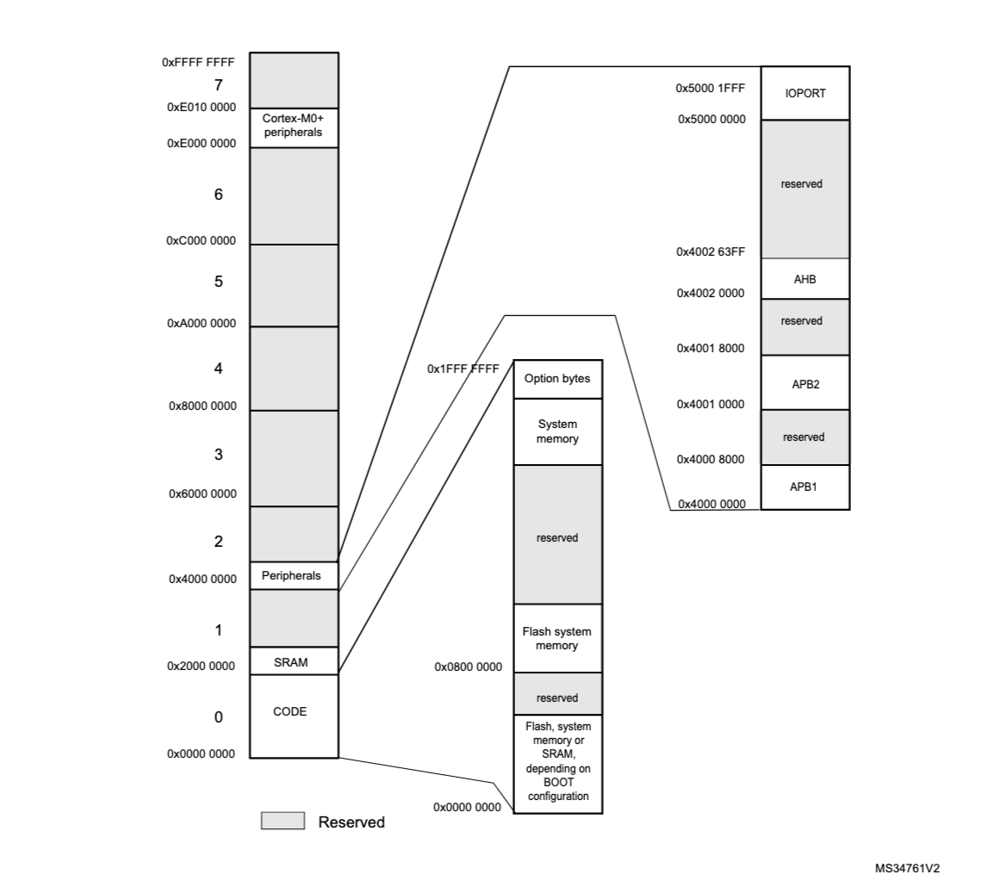

# Custom Bootloader Implmentation on STM32L053R8

This project are the part of learning Embedded System as a 4th-Year Computer Engineering Student  
The project is still in progress

---

## Goal
Be able to upload a firmware from application on a computer via USB-to-UART module to STM32L053R8 with custom bootloader and packet protocol

## Future plan
Implement a firmware encryption and firmware upload capability via USB

## Toolchain
1. arm-none-eabi-gcc
2. libopencm3
3. make
4. stlink
5. openocd
6. cortex-debug

## Hardware Memory Map

